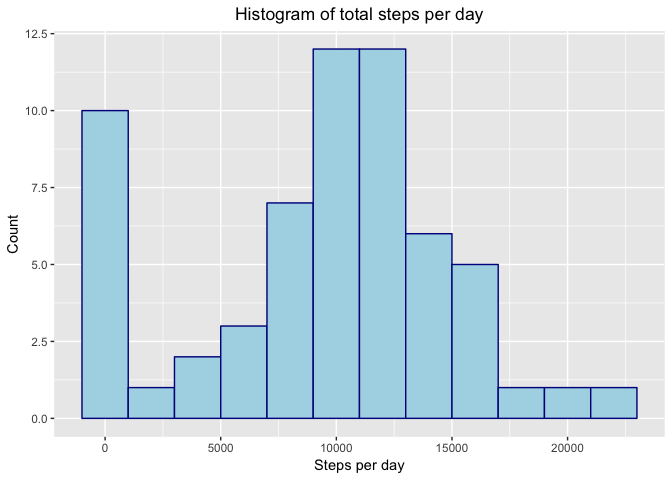
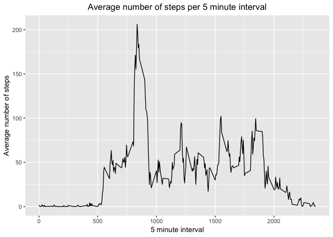
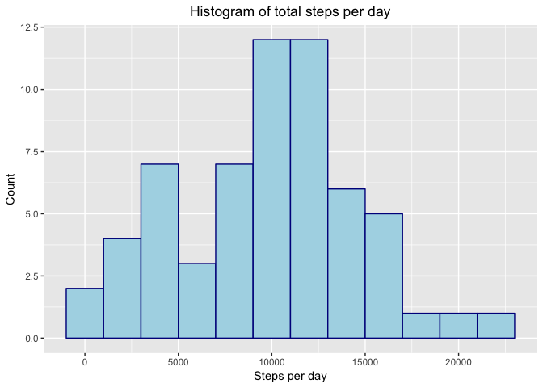
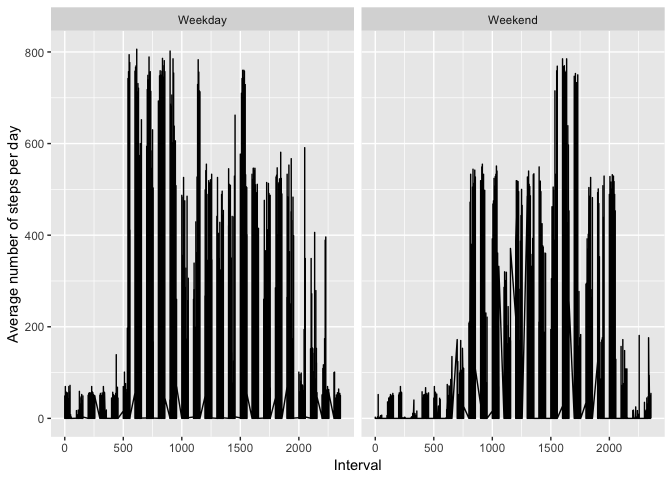

## Loading and preprocessing the data

```r
library(knitr)
opts_chunk$set(echo = TRUE)
```


```r
rm(list = ls())
#1. Loading and preprocessing the data
dat <- read.csv("activity.csv", header = TRUE, stringsAsFactors = FALSE)
str(dat)
```

```
## 'data.frame':	17568 obs. of  3 variables:
##  $ steps   : int  NA NA NA NA NA NA NA NA NA NA ...
##  $ date    : chr  "2012-10-01" "2012-10-01" "2012-10-01" "2012-10-01" ...
##  $ interval: int  0 5 10 15 20 25 30 35 40 45 ...
```

```r
head(dat)
```

```
##   steps       date interval
## 1    NA 2012-10-01        0
## 2    NA 2012-10-01        5
## 3    NA 2012-10-01       10
## 4    NA 2012-10-01       15
## 5    NA 2012-10-01       20
## 6    NA 2012-10-01       25
```

```r
tail(dat)
```

```
##       steps       date interval
## 17563    NA 2012-11-30     2330
## 17564    NA 2012-11-30     2335
## 17565    NA 2012-11-30     2340
## 17566    NA 2012-11-30     2345
## 17567    NA 2012-11-30     2350
## 17568    NA 2012-11-30     2355
```

```r
#convert date to date datatype
dat$date <- as.Date(dat$date, "%Y-%m-%d")
str(dat)
```

```
## 'data.frame':	17568 obs. of  3 variables:
##  $ steps   : int  NA NA NA NA NA NA NA NA NA NA ...
##  $ date    : Date, format: "2012-10-01" "2012-10-01" ...
##  $ interval: int  0 5 10 15 20 25 30 35 40 45 ...
```

```r
summary(dat) #Note that only the steps variable has missing values, as denoted by the 2304 NA's.
```

```
##      steps             date               interval     
##  Min.   :  0.00   Min.   :2012-10-01   Min.   :   0.0  
##  1st Qu.:  0.00   1st Qu.:2012-10-16   1st Qu.: 588.8  
##  Median :  0.00   Median :2012-10-31   Median :1177.5  
##  Mean   : 37.38   Mean   :2012-10-31   Mean   :1177.5  
##  3rd Qu.: 12.00   3rd Qu.:2012-11-15   3rd Qu.:1766.2  
##  Max.   :806.00   Max.   :2012-11-30   Max.   :2355.0  
##  NA's   :2304
```


## What is mean total number of steps taken per day?


```r
library(dplyr)
library(ggplot2)

steps_per_day <- select(dat, steps, date, interval) %>%
                    group_by(date) %>%
                    summarize(total_steps = sum(steps, na.rm = TRUE))
steps_per_day
```

```
## # A tibble: 61 x 2
##    date       total_steps
##    <date>           <int>
##  1 2012-10-01           0
##  2 2012-10-02         126
##  3 2012-10-03       11352
##  4 2012-10-04       12116
##  5 2012-10-05       13294
##  6 2012-10-06       15420
##  7 2012-10-07       11015
##  8 2012-10-08           0
##  9 2012-10-09       12811
## 10 2012-10-10        9900
## # … with 51 more rows
```


```r
ggplot(steps_per_day, aes(total_steps)) + geom_histogram(binwidth = 2000, color = "darkblue", fill = "lightblue") +
  labs(title = "Histogram of total steps per day", x = "Steps per day", y = "Count") + 
  theme(plot.title =  element_text(hjust = 0.5))
```

<!-- -->


```r
mean_total_steps <- mean(steps_per_day$total_steps)
median_total_steps <- median(steps_per_day$total_steps)
max(steps_per_day$total_steps)
```

```
## [1] 21194
```

```r
#For disabling (the printing of any value in) scientific notation
options(scipen = 999)
```

The mean total number of steps per day is 9354.23 

The median total number of steps per day is 10395


## What is the average daily activity pattern?


```r
steps_per_interval <- select(dat, steps, date, interval) %>%
  group_by(interval) %>%
  summarize(average_steps = mean(steps, na.rm = TRUE))
steps_per_interval
```

```
## # A tibble: 288 x 2
##    interval average_steps
##       <int>         <dbl>
##  1        0        1.72  
##  2        5        0.340 
##  3       10        0.132 
##  4       15        0.151 
##  5       20        0.0755
##  6       25        2.09  
##  7       30        0.528 
##  8       35        0.868 
##  9       40        0     
## 10       45        1.47  
## # … with 278 more rows
```


```r
ggplot(steps_per_interval, aes(x = interval, y = average_steps)) + 
        geom_line() +
        labs(title = "Average number of steps per 5 minute interval",
             x     = "5 minute interval",
             y     = "Average number of steps") +
        theme(plot.title =  element_text(hjust = 0.5))
```

<!-- -->


```r
(max_average_steps <- max(steps_per_interval$average_steps))
```

```
## [1] 206.1698
```

```r
(max_average_steps_interval <- steps_per_interval[
  steps_per_interval$average_steps == max_average_steps,
  ]$interval)
```

```
## [1] 835
```

The 5 minute interval 835 contains the maximum number of steps on average across all days in the dataset.


## Imputing missing values


```r
#As a preliminary step, Find the total missing values in the steps column in two different ways which serves to validate the result

(total.missing <- nrow(dat[which(is.na(dat$steps)),]))
```

```
## [1] 2304
```

```r
summary(dat$steps)["NA's"]
```

```
## NA's 
## 2304
```


```r
str(steps_per_interval)
```

```
## Classes 'tbl_df', 'tbl' and 'data.frame':	288 obs. of  2 variables:
##  $ interval     : int  0 5 10 15 20 25 30 35 40 45 ...
##  $ average_steps: num  1.717 0.3396 0.1321 0.1509 0.0755 ...
```

```r
str(dat)  
```

```
## 'data.frame':	17568 obs. of  3 variables:
##  $ steps   : int  NA NA NA NA NA NA NA NA NA NA ...
##  $ date    : Date, format: "2012-10-01" "2012-10-01" ...
##  $ interval: int  0 5 10 15 20 25 30 35 40 45 ...
```

```r
head(dat)
```

```
##   steps       date interval
## 1    NA 2012-10-01        0
## 2    NA 2012-10-01        5
## 3    NA 2012-10-01       10
## 4    NA 2012-10-01       15
## 5    NA 2012-10-01       20
## 6    NA 2012-10-01       25
```

```r
tail(dat)
```

```
##       steps       date interval
## 17563    NA 2012-11-30     2330
## 17564    NA 2012-11-30     2335
## 17565    NA 2012-11-30     2340
## 17566    NA 2012-11-30     2345
## 17567    NA 2012-11-30     2350
## 17568    NA 2012-11-30     2355
```

```r
steps_per_interval <- data.frame(steps_per_interval)
str(steps_per_interval)
```

```
## 'data.frame':	288 obs. of  2 variables:
##  $ interval     : int  0 5 10 15 20 25 30 35 40 45 ...
##  $ average_steps: num  1.717 0.3396 0.1321 0.1509 0.0755 ...
```

```r
head(steps_per_interval)
```

```
##   interval average_steps
## 1        0     1.7169811
## 2        5     0.3396226
## 3       10     0.1320755
## 4       15     0.1509434
## 5       20     0.0754717
## 6       25     2.0943396
```

```r
tail(steps_per_interval)
```

```
##     interval average_steps
## 283     2330     2.6037736
## 284     2335     4.6981132
## 285     2340     3.3018868
## 286     2345     0.6415094
## 287     2350     0.2264151
## 288     2355     1.0754717
```

```r
#if there is a missing value for the number of steps for a particular 5 minute interval on a specific date, then we fill in the missing value with the average number of steps in that 5 minute interval. For values of number of steps that are not missing we keep them as they are.

#The average number of steps in given 5 minute intervals has been computed above when we computed the variable
#steps_per_interval. We use the earlier computation to obtain the new required result.

dat <- mutate(dat, imputed.steps = ifelse(is.na(dat$steps),
                   with (steps_per_interval, average_steps[interval %in% dat$steps]), dat$steps))

head(dat)
```

```
##   steps       date interval imputed.steps
## 1    NA 2012-10-01        0     1.7169811
## 2    NA 2012-10-01        5     0.3396226
## 3    NA 2012-10-01       10     0.1320755
## 4    NA 2012-10-01       15     0.1509434
## 5    NA 2012-10-01       20     0.0754717
## 6    NA 2012-10-01       25     2.0943396
```

```r
summary(dat)
```

```
##      steps             date               interval      imputed.steps   
##  Min.   :  0.00   Min.   :2012-10-01   Min.   :   0.0   Min.   :  0.00  
##  1st Qu.:  0.00   1st Qu.:2012-10-16   1st Qu.: 588.8   1st Qu.:  0.00  
##  Median :  0.00   Median :2012-10-31   Median :1177.5   Median :  0.00  
##  Mean   : 37.38   Mean   :2012-10-31   Mean   :1177.5   Mean   : 33.87  
##  3rd Qu.: 12.00   3rd Qu.:2012-11-15   3rd Qu.:1766.2   3rd Qu.: 10.00  
##  Max.   :806.00   Max.   :2012-11-30   Max.   :2355.0   Max.   :806.00  
##  NA's   :2304
```

```r
dat <- select(dat, -steps)
head(dat)
```

```
##         date interval imputed.steps
## 1 2012-10-01        0     1.7169811
## 2 2012-10-01        5     0.3396226
## 3 2012-10-01       10     0.1320755
## 4 2012-10-01       15     0.1509434
## 5 2012-10-01       20     0.0754717
## 6 2012-10-01       25     2.0943396
```

```r
dat <- dat[,c(3,1,2)]
head(dat)
```

```
##   imputed.steps       date interval
## 1     1.7169811 2012-10-01        0
## 2     0.3396226 2012-10-01        5
## 3     0.1320755 2012-10-01       10
## 4     0.1509434 2012-10-01       15
## 5     0.0754717 2012-10-01       20
## 6     2.0943396 2012-10-01       25
```

```r
dat <- dat %>% rename(steps = imputed.steps)
head(dat)
```

```
##       steps       date interval
## 1 1.7169811 2012-10-01        0
## 2 0.3396226 2012-10-01        5
## 3 0.1320755 2012-10-01       10
## 4 0.1509434 2012-10-01       15
## 5 0.0754717 2012-10-01       20
## 6 2.0943396 2012-10-01       25
```

```r
tail(dat)
```

```
##           steps       date interval
## 17563 0.5283019 2012-11-30     2330
## 17564 0.8679245 2012-11-30     2335
## 17565 0.0000000 2012-11-30     2340
## 17566 1.4716981 2012-11-30     2345
## 17567 0.3018868 2012-11-30     2350
## 17568 0.1320755 2012-11-30     2355
```

```r
steps_per_day.adj <- select(dat, steps, date, interval) %>%
  group_by(date) %>%
  summarize(total_steps = sum(steps, na.rm = TRUE))
steps_per_day.adj
```

```
## # A tibble: 61 x 2
##    date       total_steps
##    <date>           <dbl>
##  1 2012-10-01       2556.
##  2 2012-10-02        126 
##  3 2012-10-03      11352 
##  4 2012-10-04      12116 
##  5 2012-10-05      13294 
##  6 2012-10-06      15420 
##  7 2012-10-07      11015 
##  8 2012-10-08       3012.
##  9 2012-10-09      12811 
## 10 2012-10-10       9900 
## # … with 51 more rows
```


```r
ggplot(steps_per_day.adj, aes(total_steps)) + geom_histogram(binwidth = 2000, 
          color = "darkblue", fill = "lightblue") +
  labs(title = "Histogram of total steps per day", x = "Steps per day", y = "Count") + 
  theme(plot.title =  element_text(hjust = 0.5))
```

<!-- -->

```r
(mean_total_steps.adj <- mean(steps_per_day.adj$total_steps))
```

```
## [1] 9754.713
```

```r
(median_total_steps.adj <- median(steps_per_day.adj$total_steps))
```

```
## [1] 10395
```

The total number of missing values in the dataset is 2304. As noted earlier, all the missing values are in the steps variable.<br/><br/>
Without substituting imputed values for the missing values, the mean and median values for the number of steps per day were 9354.23 and 10395 respectively which we had calculated earlier. After substituting imputed values for the missing values, the mean value for number of steps per day became 9754.71 while the median value remained the same (10395).<br/><br/>

The impact of imputing the missing data is that the number of zero values for steps per day is reduced, and consequently the distribution of the average number of steps is shifted slightly to the right.


## Are there differences in activity patterns between weekdays and weekends?

```r
#5. Differences in activity patterns between weekdays and weekends
head(dat)
```

```
##       steps       date interval
## 1 1.7169811 2012-10-01        0
## 2 0.3396226 2012-10-01        5
## 3 0.1320755 2012-10-01       10
## 4 0.1509434 2012-10-01       15
## 5 0.0754717 2012-10-01       20
## 6 2.0943396 2012-10-01       25
```

```r
str(dat)
```

```
## 'data.frame':	17568 obs. of  3 variables:
##  $ steps   : num  1.717 0.3396 0.1321 0.1509 0.0755 ...
##  $ date    : Date, format: "2012-10-01" "2012-10-01" ...
##  $ interval: int  0 5 10 15 20 25 30 35 40 45 ...
```

```r
dat <- mutate(dat, day = weekdays(date))
head(dat)
```

```
##       steps       date interval    day
## 1 1.7169811 2012-10-01        0 Monday
## 2 0.3396226 2012-10-01        5 Monday
## 3 0.1320755 2012-10-01       10 Monday
## 4 0.1509434 2012-10-01       15 Monday
## 5 0.0754717 2012-10-01       20 Monday
## 6 2.0943396 2012-10-01       25 Monday
```

```r
str(dat)
```

```
## 'data.frame':	17568 obs. of  4 variables:
##  $ steps   : num  1.717 0.3396 0.1321 0.1509 0.0755 ...
##  $ date    : Date, format: "2012-10-01" "2012-10-01" ...
##  $ interval: int  0 5 10 15 20 25 30 35 40 45 ...
##  $ day     : chr  "Monday" "Monday" "Monday" "Monday" ...
```

```r
weekdays <- c('Monday', 'Tuesday', 'Wednesday', 'Thursday', 'Friday')

dat$day = ifelse((dat$day %in% weekdays), 'Weekday', 'Weekend')
head(dat)
```

```
##       steps       date interval     day
## 1 1.7169811 2012-10-01        0 Weekday
## 2 0.3396226 2012-10-01        5 Weekday
## 3 0.1320755 2012-10-01       10 Weekday
## 4 0.1509434 2012-10-01       15 Weekday
## 5 0.0754717 2012-10-01       20 Weekday
## 6 2.0943396 2012-10-01       25 Weekday
```

```r
str(dat)
```

```
## 'data.frame':	17568 obs. of  4 variables:
##  $ steps   : num  1.717 0.3396 0.1321 0.1509 0.0755 ...
##  $ date    : Date, format: "2012-10-01" "2012-10-01" ...
##  $ interval: int  0 5 10 15 20 25 30 35 40 45 ...
##  $ day     : chr  "Weekday" "Weekday" "Weekday" "Weekday" ...
```

```r
dat$day <- as.factor(dat$day)
str(dat)
```

```
## 'data.frame':	17568 obs. of  4 variables:
##  $ steps   : num  1.717 0.3396 0.1321 0.1509 0.0755 ...
##  $ date    : Date, format: "2012-10-01" "2012-10-01" ...
##  $ interval: int  0 5 10 15 20 25 30 35 40 45 ...
##  $ day     : Factor w/ 2 levels "Weekday","Weekend": 1 1 1 1 1 1 1 1 1 1 ...
```

```r
summary(dat$day)
```

```
## Weekday Weekend 
##   12960    4608
```

```r
levels(dat$day)
```

```
## [1] "Weekday" "Weekend"
```

```r
head(dat)
```

```
##       steps       date interval     day
## 1 1.7169811 2012-10-01        0 Weekday
## 2 0.3396226 2012-10-01        5 Weekday
## 3 0.1320755 2012-10-01       10 Weekday
## 4 0.1509434 2012-10-01       15 Weekday
## 5 0.0754717 2012-10-01       20 Weekday
## 6 2.0943396 2012-10-01       25 Weekday
```


```r
ggplot(dat, aes(x = interval, y = steps)) + geom_line() +
  facet_wrap(.~day) +
  labs(x = 'Interval', y = "Average number of steps per day")
```

<!-- -->


